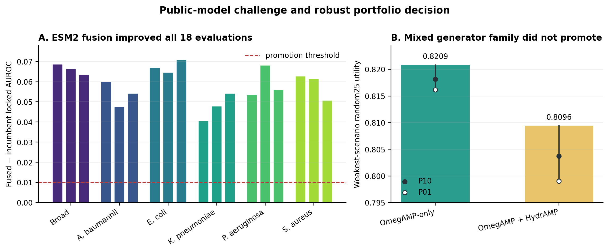

# Robust public-data antimicrobial peptide design with identity-aware model ensembles

## Abstract

We present a deterministic 50,000-member antimicrobial peptide design library
and a robustly ranked Top100 for the AMP Challenge 2027. Our aim was not to
maximize a single surrogate score, but to construct a portfolio that remains
competitive when model seed, target species, sequence novelty, and
out-of-distribution behavior are varied. We rebuilt broad and species-specific
activity models from disclosed public data, separated related sequences with
30% identity clustering, and scored a frozen population of 117,957 exact-unique
candidates. A prespecified frozen
ESM2 challenge improved locked AUROC on all 18 task-seed evaluations and was
therefore fused with the composition models at a fixed 50/50 weight. We also conducted a
prespecified generator-family challenge between OmegAMP and HydrAMP. The
mixed-family branch satisfied every sequence, diversity, and novelty constraint
but underperformed OmegAMP-only on both the mean and lower tail of the random25
robustness test. We therefore retained the OmegAMP branch. The released library
contains 50,000 exact-unique sequences from 50,000 identity clusters. Its Top100
contains 100 identity clusters, has no identity30 overlap with classifier
training sequences, has maximum reference similarity 0.778, and passes the
official sequence validator. These results establish public-data surrogate
quality and reproducibility, not measured antimicrobial efficacy or safety.

## 1. Motivation

Antimicrobial peptide generation is a multi-objective problem. A candidate must
be plausible under imperfect activity models, remain sufficiently novel, avoid
obvious sequence pathologies, and contribute to a portfolio that survives the
challenge's random sampling of 25 peptides from the submitted Top100. Optimizing
one model or one mean score can instead concentrate the library around a narrow
sequence family and amplify surrogate-model error. We therefore treated final
selection as robust portfolio construction under several deliberately different
public evidence surfaces.

Our development process also separated scientific negative results from
engineering and disclosure constraints. Earlier experiments showed that ESM2
LoRA variants for quantitative MIC did not improve their frozen baseline, a simple ANKH–ESM2 rank
consensus did not generalize across source-held-out folds, a quantitative HC50
head was not reliable enough to rank safety, and trust-region generation failed
its prespecified elite-regret gate. Those branches were stopped rather than
repeated until a favorable result appeared. Those failures did not test the
later public-label ESM2 classifier, which used different labels, an independently
frozen protocol, and no backbone updates.

## 2. Public data and candidate population

The public activity table was reconstructed from disclosed OmegAMP materials.
After sequence validation and canonicalization it contained 322,267 unique
sequences in the challenge domain. This number must not be read as 322,267
experimentally measured AMPs: it includes assumed negatives, synthetic decoys,
and controls. Its broad-task composition was:

| Broad-task role | Rows | Used for fitting |
|---|---:|---|
| Curated AMP positive | 3,970 | Yes |
| Curated non-AMP negative | 871 | Yes |
| UniProt-derived assumed negative | 7,188 | Yes |
| Random, shuffled, or mutated decoy | 293,734 | Yes |
| Signal or metabolic control | 16,498 | No |
| Curated rows with a broad-label conflict | 6 | No |

Species tasks used source-listed positive and negative identifiers for
*Acinetobacter baumannii*, *Escherichia coli*, *Klebsiella pneumoniae*,
*Pseudomonas aeruginosa*, and *Staphylococcus aureus*. The respective
positive/source-listed-negative counts were 720/192, 2,798/900, 645/312,
1,537/735, and 2,232/973. The same 7,188 UniProt assumed negatives and 293,734
synthetic decoys were eligible in each species task. A peptide with no label for
a species remained unknown and was excluded from that task; missing activity
was never converted to an experimental negative. Exact-label conflicts were
resolved within each task. A peptide active against one species and inactive
against another was therefore not treated as a conflict.

The frozen candidate population contained 117,957 exact-unique sequences:
67,957 public OmegAMP diffusion candidates and the 50,000 sequences distributed
with the official HydrAMP starter. The two families had no exact cross-family
overlap. Twenty candidates that exactly matched public classifier training
sequences were excluded from final-library eligibility. The official
antibacterial reference was used only for novelty checks and was not treated as
a source of candidate labels.

DBAASP, DRAMP, dbAMP, APD/APD6, GRAMPA, AMP Scanner, Peptipedia, and UniProt
contributed through upstream training snapshots, external evaluation, or
novelty audits as documented in the repository's source-use matrix. We did not
silently pool records whose assay units, duplicate publications, chemistry, or
redistribution status had not been harmonized, nor convert DRAMP/Hemolytik
hemolysis records into unsupported safety labels.

## 3. Identity-aware public activity models

We trained six binary activity tasks with three fixed seeds, producing 18
models. Each model averaged two low-capacity learners over sequence composition
and physicochemical features: standardized class-balanced logistic regression
and class-balanced histogram gradient boosting. A logistic calibrator was fit
only on the tuning partition. The features described length, net charge density,
hydrophobic and aromatic fractions, residue composition, local half-sequence
composition, entropy, and repeat behavior.

To reduce sequence-family leakage, MMseqs2 build
`17b688d21dda57fc5f5b7286ecba7ec003d4717f` clustered the union of training and
candidate sequences with `easy-cluster --min-seq-id 0.30 -c 0.80 --cov-mode 0
--cluster-mode 2`. Each seed assigned whole clusters, rather than individual
rows, to 70% fitting, 15% tuning, and 15% evaluation partitions. Candidate
sequences sharing a cluster with public training data were marked and later
forbidden from the Top100. “Different clusters” is a result under these
parameters; it is not asserted to prove that every possible pairwise alignment
is below 30% identity.

Across the 18 locked evaluations, incumbent AUROC ranged from 0.815 to 0.887. The
signal/metabolic controls had mean predicted activity between 0.004 and 0.028,
with essentially no predictions above 0.5. The models therefore supplied a
useful public ranking surface without suggesting that their probabilities were
MIC values, safety measurements, or official hidden-label probabilities.

We then challenged this surface with the public frozen
`facebook/esm2_t12_35M_UR50D` backbone. Mean-pooled residue representations were
concatenated with the same 72 public sequence features and fitted with a
class-balanced linear head; only the head and tune-only calibrator were trained.
The fusion weight and promotion thresholds were fixed before representation
extraction. On evaluation rows we averaged calibrated probabilities,
`p_fused = 0.5 p_composition + 0.5 p_ESM`. This fusion improved AUROC in all 18 evaluations: the
median gain was 0.0607, the smallest individual gain was 0.0405, and the six
task-average gains ranged from 0.0475 to 0.0673. Locked-control behavior remained
inside the prespecified tolerance, so the ESM branch was promoted. Controls
never entered fitting, but their metrics participated in promotion decisions;
they should not be interpreted as an untouched final test set after selection.

The strong 35M result motivated one additional prespecified capacity challenge:
we replaced it with frozen ESM2-150M while holding the rows, split, head,
calibration, fusion weight, controls, and candidate population fixed. The larger
backbone did not pass its replacement gate. Median fused AUROC improvement over
35M was only 0.0018; the worst individual change was −0.0110, and mean changes
for *A. baumannii* and *K. pneumoniae* were −0.0044 and −0.0043. We therefore
retained ESM2-35M rather than assuming that greater model capacity implied a
more robust public ranking surface.

We also tested whether the fixed fusion should place more weight on ESM2-35M.
Because the original evaluation results could not legitimately tune that choice, we
used three additional identity-cluster split seeds and divided each tuning
partition into separate calibration and weight-selection halves. Unconstrained
tuning selected ESM weights of 0.75 or 1.0 in 17 of 18 evaluations and improved
new locked AUROC by a median 0.0040, but maximum locked-control FPR increased
from 0.0032 to 0.0207. A final experiment on a third set of fresh split seeds
allowed non-default weights only when ordinary tuning negatives preserved FPR
and mean-probability tolerances. It selected the default 0.5 in 13 of 18 cases,
produced zero median locked gain, and still increased maximum locked-control FPR
from 0.0036 to 0.0080. Neither weighting challenge passed its prespecified gate.
These runs provide additional split-sensitivity evidence for retaining 50/50,
not statistically independent validation: all splits reused the same underlying
sequence table, and partitions can overlap across runs.

## 4. Robust library and Top100 selection

Candidate ranking deliberately used a different operation from evaluation
probability fusion. For every task and split seed, composition and ESM scores
were mapped to empirical percentiles over the complete frozen 117,957-candidate
union, then combined as `u(x)=0.5 F_pool(p_composition(x)) + 0.5
F_pool(p_ESM(x))`. This is a ranking utility, not a calibrated probability, and
the AUROC evidence above is evidence for the component predictors and their
probability fusion rather than a claim that the two operations are identical.

Four fixed scenarios then combined percentile utilities. The balanced weights
were broad worst/mean 0.20/0.10, species worst/mean 0.25/0.15, seed stability
0.10, descriptor transport 0.10, and training-cluster novelty 0.10. The
species-adversarial weights were species worst/mean 0.45/0.15, broad worst 0.10,
stability 0.10, transport 0.10, and novelty 0.10. The broad-adversarial weights
were broad worst/mean 0.40/0.20, species worst 0.10, stability 0.10, transport
0.10, and novelty 0.10. The transport weights were descriptor transport 0.30,
sequence complexity 0.20, novelty 0.20, broad worst 0.10, species worst 0.10,
and stability 0.10. Descriptor distance used a Ledoit–Wolf shrinkage
Mahalanobis model fit only on disclosed curated AMP positives. The frozen
machine-readable configuration is `config/selection_protocol.json`.

Candidates were ordered lexicographically by their worst scenario, the average
of their two worst scenarios, and their mean utility. The 50,000-member library
required valid challenge sequences, exact uniqueness, no exact match to public
training or official reference sequences, and at most one member per identity30
cluster. The Top100 added stricter complexity and public-AMP descriptor
envelopes, zero identity30 overlap with classifier training, at most 15
OmegAMP sequences from one generation seed, maximum Levenshtein similarity
0.78 to the official reference, and maximum internal pairwise similarity 0.80.

For Random-25, each draw sampled 25 distinct Top100 members. We first averaged
each of the four scenario scores over those 25 members and then took the minimum
of the four resulting means. We did not first take each peptide's worst scenario
and then average. This order is used for the mean and tail summaries below.

## 5. Generator-family challenge

We compared an OmegAMP-only incumbent with a mixed OmegAMP–HydrAMP challenger on
the same frozen model surface and constraints. The mixed 50,000 library
contained 22,293 OmegAMP and 27,707 HydrAMP sequences. Its Top100 contained 65
OmegAMP and 35 HydrAMP candidates. Both branches had 50,000 identity clusters in
their full libraries and 100 identity clusters in their Top100 lists, and both
passed all reference, internal-similarity, complexity, family, and generation-
seed constraints.

The promotion decision used 10,000 fixed-seed draws of 25 peptides from each
Top100. For the final V5 OmegAMP-only branch, the weakest-scenario mean was
0.8201, with P10 0.8171 and P01 0.8152. For the mixed branch, the corresponding
values were 0.8094, 0.8035, and 0.7987. Thus the mixed branch was lower by
0.0108 in mean and 0.0136 at P10. Because promotion required a non-negative P10
difference and at least a 0.005 mean improvement, HydrAMP was not promoted.

This is a useful negative result rather than evidence that HydrAMP sequences
are inactive. HydrAMP contributed genuinely different sequence geometry and
passed every structural constraint, but that additional diversity did not
improve the frozen public robustness objective. The result also did not alter
the earlier research-only ANKH/ESM2 findings because those models were not read
by this selection pipeline.

## 6. Final library and validation

The final public-data candidate is therefore the OmegAMP-only branch. Its full
library contains 50,000 exact-unique sequences and 50,000 identity30 clusters.
The Top100 contains 100 exact-unique sequences and 100 identity30 clusters. No
Top100 sequence shares an identity30 cluster with the public classifier
training table. Maximum similarity to the official antibacterial reference is
0.778, and maximum internal Top100 similarity is 0.698. Relative to the
composition-only selection, ESM fusion replaced 501 members of the 50,000 library
and 55 members of the Top100. Ninety-five of the new Top100 were already present
in the earlier 50,000 library, showing that the main effect was reranking rather
than a wholesale shift of the generated population. This ESM-fused,
direct-identity30 OmegAMP result is the frozen **G6 V5** release discussed below.

The repository entry point, `uv run generate`, deterministically materializes
`generate/library.fasta` and `generate/top.fasta` with simple ranked identifiers.
Two consecutive local runs produced byte-identical files. The official
validator confirmed 50,000 unique sequences, the standard amino-acid alphabet,
length 8–50, Top100 containment, zero exact overlap between the library and the
official reference, and compliance with the official Top100 similarity limit.

### V7.1 closing audit

The version order was: OmegAMP/HydrAMP candidate challenge on the 117,957-row
pool; ESM fusion and direct identity30 correction; freeze of the OmegAMP-only G6
V5 library and Top100; then an ARCADIAMP closing audit. ARCADIAMP was therefore
a later challenger supply, not part of the earlier 117,957-row candidate pool.
Its matched closing-audit pool contained 4,987 eligible ARCADIAMP and 3,274
eligible OmegAMP sequences. “No new candidate pools” means that this capstone
audit did not add candidates after its scope was fixed; it does not mean the
whole study used only the earlier OmegAMP/HydrAMP pool.

Six Top100 challengers with ARCADIAMP/OmegAMP proportions of 0/100, 25/75,
50/50, 55/45, 75/25, and 100/0 were compared with the frozen G6 V5 Top100. The
matched 0/100 arm was an OmegAMP comparator selected from the capstone matched
pool; sharing the same generator proportion did not make it the G6 V5 set. The
V7.1 membership table's `G6_V5_true` arm and this repository's
`frozen_top100.fasta` are exactly identical in all 100 sequences and in rank
order. Thus “retained G6 V5 unchanged” means unchanged relative to that
ESM-fused, direct-identity30 frozen release, not merely another OmegAMP-only set.

The five capstone gates, fixed before the closing predictions, were: (1) pass
sequence validity, uniqueness, length, novelty, release, and identity
constraints; (2) improve at least one Phase-1 proxy family without degradation
beyond its fixed resampling tolerance; (3) obtain strictly positive paired
bootstrap confidence-interval lower bounds for broad and MDR expected utility;
(4) retain a favorable direction after leaving out each model family; and (5)
not increase the double-red safety-proxy fraction. These are distinct from the
earlier HydrAMP rules in Section 5.

The original generator challenge retained its fixed 10,000-draw decision; the
closing audit used 100,000 common-random-number Random-25 draws to estimate mean,
median, P01/P10/P90/P99, one-draw failure probability, and pairing sensitivity.
Here one-draw failure probability means the probability that one sampled
25-peptide portfolio has proxy-utility delta at or below zero relative to V5;
it is not the probability that 25 peptides fail in wet-lab testing. The audit
also evaluated selection-aware external APEX and HemoPI2 deltas, family
leave-one-out stability, and public endpoint diagnostics.

Frozen ESM2 and ANKH HC50/selectivity heads were applied to the complete
344-sequence union and to every Random-25 scheme. HemoPI2 was treated as a
separate hemolysis diagnostic rather than a substitute for the official
HC50/MIC endpoint. These endpoint models are imperfect public surrogates, so
they were not used post hoc to redefine the selection rule or certify safety.
Every challenger failed at least the fixed external-evidence and safety gates;
the closing decision therefore retained G6 V5 unchanged.

## 7. Limitations and claim boundary

The central limitation is that official candidate labels and wet-lab
measurements were unavailable. Identity-aware public holdouts reduce but do not
eliminate dataset shift, source bias, or surrogate exploitation. The public
models predict sequence labels rather than strain-resolved MIC under controlled
assay conditions. We also lack a quantitatively reliable HC50 or hemolysis model;
consequently, no candidate is described as safe. The proposed Top100 should be
interpreted as an experimentally prioritized, diverse portfolio rather than a
set of validated therapeutics.

Future improvements should focus on standardized strain-level MIC records,
assay-context modeling, reliable negatives, and experimentally measured
hemolysis or cytotoxicity. These additions are more likely to change decision
quality than repeatedly adding overlapping AMP-positive databases. Wet-lab
testing remains the decisive next stage.

## 8. Reproducibility and files

Public project repository:
https://github.com/Fethian/amp-challenge-2027-full-track

The repository exposes three distinct entry points:

1. **Frozen release:** `uv run generate` materializes the submitted
   `library.fasta` and `top.fasta`; the root frozen FASTA files define the
   release version.
2. **Research lineage:** `vendor/omegamp/`, `scripts/score_public_activity.py`,
   `scripts/score_public_esm.py`, `models/`, `training_data/`, and
   `config/selection_protocol.json` disclose
   generation, inference, fitted heads, data roles, and the ranking contract.
3. **Audit and verification:** `TOP100_SELECTION.md`,
   `audit/v7_1_decision_summary.csv`, and `scripts/verify_submission.py` expose
   the version mapping, closing decision, and official-format verification.

Two identical `uv run generate` exports prove deterministic materialization of
the frozen release. They do not by themselves prove that every research-time
GPU training and candidate-search step was rerun from scratch. Those heavier
steps are disclosed separately through source, weights, data snapshots, and
configuration. The Kaggle submission links this public repository and attaches
the generated FASTA files as project files.

The submission makes no claim of hidden-label performance, antimicrobial
activity, low hemolysis, clinical safety, or therapeutic efficacy. Its supported
claims are format compliance, public-data surrogate performance, diversity,
novelty, deterministic reproduction, and transparent negative model selection.

## References and public software

- [OmegAMP public repository](https://github.com/szczurek-lab/OmegAMP)
- [HydrAMP AMP Challenge starter](https://github.com/szczurek-lab/hydramp-starter-kit)
- [ESM protein language models](https://github.com/facebookresearch/esm)
- [ARCADIAMP public repository](https://github.com/IBPA/ARCADIAMP)
- [MMseqs2](https://github.com/soedinglab/MMseqs2)
